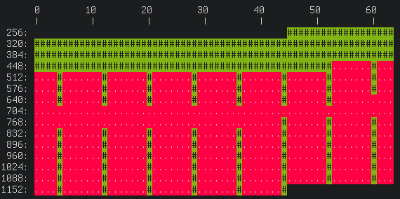

# Configuration Inventory

We have our configurations a format that can be expressed as `conf\.\d{4}`
(regex) or `conf.%04d` (printf). Getting an overview by looking at the output
of `ls` is hard for humans, therefore this provides a visualization of the
files in the directory.

License is MIT/Expat.

## Usage

Install the Python 3 module `termcolor`. On most machines this just works with
`pip3 install --user termcolor`. On JURECA you have to first do `module load
Python`.

Just call the script in a directory and it will show you all subdirectories
where files with the pattern could be found. You can also specify directories.
In order to get an overview of the available options, run `./conf-inventory
-h`.

## Example

The the following directory:

```
conf.0301  conf.0340  conf.0379  conf.0418  conf.0457  conf.0496  conf.0892
conf.0302  conf.0341  conf.0380  conf.0419  conf.0458  conf.0497  conf.0900
conf.0303  conf.0342  conf.0381  conf.0420  conf.0459  conf.0498  conf.0908
conf.0304  conf.0343  conf.0382  conf.0421  conf.0460  conf.0499  conf.0916
conf.0305  conf.0344  conf.0383  conf.0422  conf.0461  conf.0500  conf.0924
conf.0306  conf.0345  conf.0384  conf.0423  conf.0462  conf.0508  conf.0932
conf.0307  conf.0346  conf.0385  conf.0424  conf.0463  conf.0516  conf.0940
conf.0308  conf.0347  conf.0386  conf.0425  conf.0464  conf.0524  conf.0948
conf.0309  conf.0348  conf.0387  conf.0426  conf.0465  conf.0532  conf.0956
conf.0310  conf.0349  conf.0388  conf.0427  conf.0466  conf.0540  conf.0964
conf.0311  conf.0350  conf.0389  conf.0428  conf.0467  conf.0548  conf.0972
conf.0312  conf.0351  conf.0390  conf.0429  conf.0468  conf.0556  conf.0980
conf.0313  conf.0352  conf.0391  conf.0430  conf.0469  conf.0564  conf.0988
conf.0314  conf.0353  conf.0392  conf.0431  conf.0470  conf.0572  conf.0996
conf.0315  conf.0354  conf.0393  conf.0432  conf.0471  conf.0580  conf.1004
conf.0316  conf.0355  conf.0394  conf.0433  conf.0472  conf.0588  conf.1012
conf.0317  conf.0356  conf.0395  conf.0434  conf.0473  conf.0596  conf.1020
conf.0318  conf.0357  conf.0396  conf.0435  conf.0474  conf.0604  conf.1028
conf.0319  conf.0358  conf.0397  conf.0436  conf.0475  conf.0612  conf.1036
conf.0320  conf.0359  conf.0398  conf.0437  conf.0476  conf.0620  conf.1044
conf.0321  conf.0360  conf.0399  conf.0438  conf.0477  conf.0628  conf.1052
conf.0322  conf.0361  conf.0400  conf.0439  conf.0478  conf.0636  conf.1060
conf.0323  conf.0362  conf.0401  conf.0440  conf.0479  conf.0644  conf.1068
conf.0324  conf.0363  conf.0402  conf.0441  conf.0480  conf.0652  conf.1076
conf.0325  conf.0364  conf.0403  conf.0442  conf.0481  conf.0660  conf.1084
conf.0326  conf.0365  conf.0404  conf.0443  conf.0482  conf.0668  conf.1092
conf.0327  conf.0366  conf.0405  conf.0444  conf.0483  conf.0676  conf.1100
conf.0328  conf.0367  conf.0406  conf.0445  conf.0484  conf.0684  conf.1108
conf.0329  conf.0368  conf.0407  conf.0446  conf.0485  conf.0692  conf.1116
conf.0330  conf.0369  conf.0408  conf.0447  conf.0486  conf.0812  conf.1124
conf.0331  conf.0370  conf.0409  conf.0448  conf.0487  conf.0820  conf.1132
conf.0332  conf.0371  conf.0410  conf.0449  conf.0488  conf.0828  conf.1140
conf.0333  conf.0372  conf.0411  conf.0450  conf.0489  conf.0836  conf.1148
conf.0334  conf.0373  conf.0412  conf.0451  conf.0490  conf.0844  conf.1156
conf.0335  conf.0374  conf.0413  conf.0452  conf.0491  conf.0852  conf.1164
conf.0336  conf.0375  conf.0414  conf.0453  conf.0492  conf.0860  conf.1172
conf.0337  conf.0376  conf.0415  conf.0454  conf.0493  conf.0868  conf.1180
conf.0338  conf.0377  conf.0416  conf.0455  conf.0494  conf.0876  conf.1188
conf.0339  conf.0378  conf.0417  conf.0456  conf.0495  conf.0884  conf.1196
```

Running it with modulus 100 (the default) shows the following:


One can clearly see that there are all configurations up to 500 and then in
steps of 8. There seems to be missing ones in the 700 region.

Using a modulus of 64 makes it easer to work with directories where you expect
every 8th configuration to be present:


